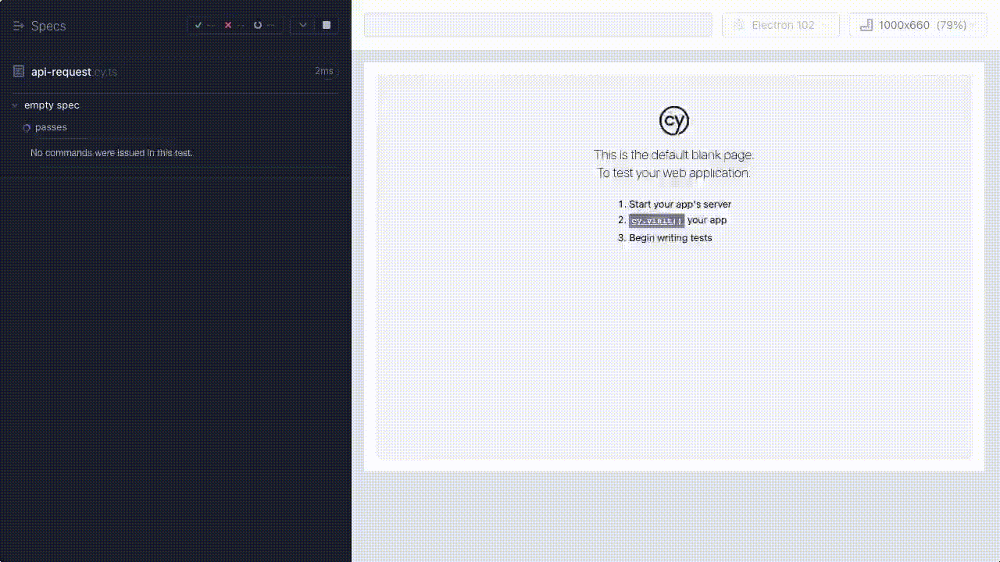

# Steps to reproduce the issue

- Follow the steps to getting Keycloak running locally with Docker [here](https://www.keycloak.org/getting-started/getting-started-docker) while accounting for the exceptions below:
* Be sure to keep the docker image running on port 8080. Killing the docker image will result in all configurations lost.
* When creating the user
  * set the username to `myuser`
  * set the password to `testuser` and turn `temporary` to `off`.

* When creating the client
  * set the client id to `myclient`
  * turn `Client authentication` to `on`
  * set the Root URL / Admin URL on the client to `http://localhost:8080`
  * set valid redirect URIs to `*`
  * set Web Origins to `*`
  * `Save` and go to `Credentials` of the Client and copy the `Client secret`
  * Paste the `Client secret` in the `.env` file in the project

* Inside the project directory, run `yarn`.
* Spin up the dev server by running `yarn dev`
* In another terminal, run `yarn cy:open` and execute the `api-request.cy.js` test.
* The frontend will receive the string lengths of each cookie the API received and shows them on the page.
* Notice the cookies received by the API and returned back to the test page are all doubled. The bottom line `all:` should display a value below `600`.

